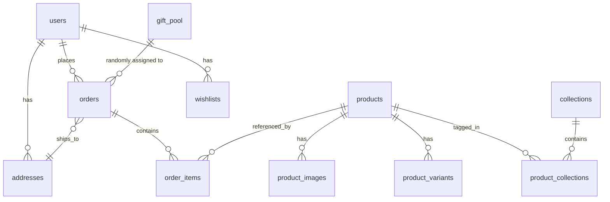

# Architecture Document
## AT Ornaments — E-Commerce Platform

**Version:** 1.0 (derived from PRD v2.0)
**Scope:** Technical architecture for a solo-founder-built, free-tier-first Next.js e-commerce platform.

---

## 1. Architecture Overview

AT Ornaments is a **monolithic Next.js application** (App Router) that serves both the storefront UI and the backend API via Route Handlers, backed by Supabase (Postgres + Auth + Storage) and integrated with two external services (Razorpay for payments, Shiprocket for fulfillment). There is no separate backend service — this keeps the whole system deployable as a single Vercel project on free tier.

```mermaid
flowchart TB
    subgraph Client["Browser (Customer / Admin)"]
        UI[Next.js App Router UI\nFramer Motion + Embla]
    end

    subgraph Vercel["Vercel (Next.js App)"]
        Pages[Pages / Server Components]
        API[Route Handlers /api/*]
        MW[Middleware\n(auth guard, admin guard)]
    end

    subgraph Supabase["Supabase (Free Tier)"]
        DB[(Postgres DB)]
        Auth[Supabase Auth]
        Storage[(Storage: product images, invoices)]
    end

    subgraph External["External Services"]
        RZP[Razorpay\nStandard Checkout + Webhooks]
        SR[Shiprocket API]
    end

    UI -->|SSR/CSR fetch| Pages
    UI -->|fetch| API
    API --> MW
    MW --> Auth
    API --> DB
    API --> Storage
    API -->|create order / verify webhook| RZP
    API -->|create shipment / track| SR
    RZP -->|webhook: payment.captured| API
    Pages --> DB
    Pages --> Storage
```

---

## 2. Layered Architecture

| Layer | Responsibility | Technology |
|---|---|---|
| Presentation | Storefront pages, admin UI, animation | Next.js App Router (Server + Client Components), Tailwind CSS, Framer Motion, Embla Carousel, react-intersection-observer |
| API / Application | Business logic, orchestration, validation | Next.js Route Handlers (`/app/api/**/route.ts`) |
| Data | Persistence, relational integrity | Supabase Postgres |
| Identity | Auth, session, role checks | Supabase Auth (email/password, optional Google OAuth) |
| File storage | Product images, generated invoice PDFs | Supabase Storage |
| Payments | Checkout, payment capture, verification | Razorpay Standard Checkout + Webhooks |
| Fulfillment | Shipment creation, tracking | Shiprocket API |
| Hosting/Infra | Build, deploy, edge delivery, TLS | Vercel (free tier) |

---

## 3. Frontend Architecture

### 3.1 Folder structure (App Router)

```
app/
  (storefront)/
    page.tsx                    # Home
    shop/page.tsx                # Shop (filterable)
    category/[slug]/page.tsx     # Chain / Anklet / Ring / Bracelet
    product/[slug]/page.tsx      # PDP
    checkout/page.tsx
    order-confirmation/[id]/page.tsx
    account/
      page.tsx
      orders/page.tsx
      addresses/page.tsx
      wishlist/page.tsx
    about/page.tsx
    contact/page.tsx
    track-order/page.tsx
    policies/[slug]/page.tsx
  admin/
    page.tsx                     # Dashboard
    products/
    orders/
    gift-pool/
    settings/
  api/
    products/route.ts
    products/[id]/route.ts
    cart/... (if server-persisted cart is used)
    checkout/create-order/route.ts
    payments/webhook/route.ts
    orders/[id]/invoice/route.ts
    shipping/create/route.ts
    shipping/track/[awb]/route.ts
    admin/products/route.ts
    admin/silver-rate/route.ts
    admin/gift-pool/route.ts
    admin/gift-threshold/route.ts
    admin/gst-settings/route.ts
components/
  layout/ (Header, MarqueeBar, Footer)
  product/ (ProductCard w/ hover-swap, Gallery, SizeSelector)
  cart/ (CartDrawer, FreeGiftProgressBar)
  home/ (Hero, CategoryTiles, StatCounters, ShopByLook)
  admin/ (ProductForm, OrderTable, GiftPoolManager)
lib/
  supabase/ (client.ts, server.ts, admin.ts)
  razorpay/ (client.ts, verify-signature.ts)
  shiprocket/ (client.ts)
  pricing/ (computeWeightBasedPrice.ts, applyFreeGift.ts)
  invoice/ (generateInvoicePdf.ts, gstCalculator.ts)
  motion/ (variants.ts — shared Framer Motion variants, reduced-motion wrapper)
```

### 3.2 Rendering strategy
- **Home, Shop, Category, PDP:** Server Components for initial data fetch (SEO-critical, product structured data), hydrated with Client Components for interactive pieces (hover-swap, carousel, cart drawer trigger).
- **Cart drawer:** Client-side global state (React Context or Zustand) synced to `localStorage`/Supabase (guest cart in browser storage; merged into DB cart on login) — avoids an extra DB round-trip for every cart mutation.
- **Checkout, Account, Admin:** Client Components with server-verified session; admin routes gated by middleware.
- **Animations:** All motion wrapped in a shared `MotionSafe` component that reads `prefers-reduced-motion` and disables transforms/transitions accordingly (per NFR in PRD §12).

### 3.3 State ownership
| State | Owner | Persistence |
|---|---|---|
| Cart (guest) | Client Context | `localStorage` |
| Cart (logged-in) | Client Context, synced | Supabase `cart_items` (optional) or re-derived from localStorage on login |
| Auth session | Supabase Auth | HTTP-only cookie (SSR-readable) |
| Today's silver rate | Server (DB) | `settings` table, read at product-fetch time |
| Free-gift threshold/pool | Server (DB) | `settings` + `gift_pool` tables |

---

## 4. Backend / API Architecture

Route Handlers are grouped by concern and are the **only** place business logic lives (no logic duplicated in components). Each handler:
1. Validates input (zod schema).
2. Authenticates/authorizes (Supabase session; admin routes check a role claim).
3. Performs the operation against Supabase using the **service role key only on the server**.
4. Returns typed JSON.

### 4.1 Key request flows

**Weight-based pricing resolution** (used by product list/detail and cart recompute):
```
price = pricing_type == 'fixed'
  ? fixed_price
  : (weight_grams * settings.today_silver_rate_per_gram) + making_charge
```
This is computed server-side at read time — never trust a client-submitted price. At checkout, the order total is **recomputed server-side** from current `products`/`settings` data before creating the Razorpay order, not taken from the client cart payload.

**Checkout → Payment → Fulfillment pipeline:**
```
POST /api/checkout/create-order
  → validate cart, recompute totals server-side
  → if subtotal >= gift_threshold: pick random active gift_pool row → attach free_gift_name
  → create Razorpay order (amount, currency, receipt)
  → insert `orders` row (status = 'created') + `order_items` (snapshotted name/price/HSN)
  → return razorpay_order_id + key to client

Client → Razorpay Checkout widget → payment

POST /api/payments/webhook  (Razorpay → server)
  → verify HMAC signature against webhook secret (reject if invalid)
  → on payment.captured: set orders.status = 'paid', store razorpay_payment_id
  → trigger invoice generation (next section)
  → trigger Shiprocket shipment creation (POST /api/shipping/create, called internally)
  → orders.status = 'processing', store shiprocket_order_id / awb_code
```

**Invoice generation** (`lib/invoice/generateInvoicePdf.ts`, invoked after `paid`):
```
1. Lock next invoice_number (sequential; prefix from settings.invoice_number_prefix)
2. Determine tax split: buyer_state == business_state ? CGST+SGST : IGST
3. Render PDF (business name/GSTIN/address from settings, order_items with HSN, totals)
4. Upload to Supabase Storage → store invoice_pdf_url on order
5. Expose via GET /api/orders/[id]/invoice (owner or admin only)
```

### 4.2 Authorization model
- **Public:** product browse, category, PDP, policy pages.
- **Authenticated customer:** checkout, own orders, own invoice, wishlist, addresses.
- **Admin:** all `/api/admin/**` routes — gated via a `role = 'admin'` claim on the Supabase user (checked in middleware + re-checked inside each handler; never trust middleware alone).

---

## 5. Data Architecture (Entity Relationships)



- `settings` is a single-row-per-key config table (silver rate, gift threshold, GSTIN, invoice prefix) — read on nearly every pricing/invoice operation, so it's a hot table kept small and indexed by `key`.
- `order_items` denormalizes `product_name_snapshot`, `price_snapshot`, `hsn_code_snapshot` so historical orders and invoices remain accurate even if the product catalog changes later.
- `orders.free_gift_name` is likewise a snapshot, not a foreign key to `gift_pool` — matches the PRD's stated intent that what shipped is what's recorded.

---

## 6. Integration Architecture

### 6.1 Razorpay
- **Mode:** Standard Checkout (hosted), not custom card fields — minimizes PCI scope.
- **Server → Razorpay:** create order via Orders API.
- **Razorpay → Server:** webhook on `payment.captured` / `payment.failed`; **signature verified server-side** using the webhook secret before any state change (PRD §7.4 — never trust client-side success alone).
- **Idempotency:** webhook handler checks `orders.status` before transitioning, so a retried webhook delivery doesn't double-process.

### 6.2 Shiprocket
- Triggered internally once `orders.status = 'paid'`.
- Creates shipment, stores `shiprocket_order_id` and `awb_code` on the order.
- `Track Order` page and My Account → Order History call `GET /api/shipping/track/[awb]`, which proxies Shiprocket's tracking endpoint (avoids exposing Shiprocket API keys to the client).

### 6.3 Supabase
- **Auth:** email/password + optional Google OAuth; session cookie read in middleware for route protection.
- **DB:** accessed via service-role key only inside Route Handlers (server-only); the anon key (RLS-scoped) is used for client-side reads where applicable (e.g., product list) to reduce API load, with Row-Level Security policies restricting writes.
- **Storage:** two buckets — `product-images` (public read) and `invoices` (private, signed-URL access only).

---

## 7. Animation Architecture

Motion is treated as a cross-cutting concern, not per-component ad hoc code:
- `lib/motion/variants.ts` centralizes reusable Framer Motion variants (fade-up, stagger, scale-hover) so the "80ms stagger" and hover/reveal timings stay consistent site-wide.
- A `useReducedMotionSafe()` hook wraps `prefers-reduced-motion` detection once; all animated components consume it rather than each re-implementing the media query.
- Embla Carousel powers the "Shop by Look" horizontal strip and PDP gallery swipe — chosen over Framer Motion drag for native-feeling snap-scroll behavior.
- `react-intersection-observer` triggers stat counters and section reveals only once (guarded by a `hasAnimated` ref) to avoid re-triggering on scroll-up.
- Video assets for "Shop by Look" are lazy-loaded (NFR §12) and muted-autoplay only when in viewport.

---

## 8. Deployment & Environments

| Environment | Purpose | Notes |
|---|---|---|
| Local | Development | `.env.local` with Supabase project (dev) + Razorpay/Shiprocket test keys |
| Preview | Per-PR/branch Vercel preview | Points to a Supabase dev or branch DB; Razorpay test mode |
| Production | Live storefront | `ayushtraders.vercel.app` initially → custom domain later (PRD §11), Razorpay live mode (post-KYC), Shiprocket live |

No infra migration is needed to attach a custom domain later — Vercel domain settings + DNS only, no redeploy (per PRD).

### 8.1 Secrets
Stored as Vercel Environment Variables, never committed:
`SUPABASE_URL`, `SUPABASE_SERVICE_ROLE_KEY`, `SUPABASE_ANON_KEY`, `RAZORPAY_KEY_ID`, `RAZORPAY_KEY_SECRET`, `RAZORPAY_WEBHOOK_SECRET`, `SHIPROCKET_EMAIL`, `SHIPROCKET_PASSWORD` (or token), `NEXT_PUBLIC_SITE_URL`.

---

## 9. Non-Functional Architecture Notes
- **Free-tier constraints:** Supabase free tier has connection/row limits — fine for a ~20-product catalog and low order volume at launch; schema keeps tables small and normalized to stay well under limits.
- **Security:** service-role key never reaches the client; all price-affecting logic (weight-based pricing, gift selection, totals) is recomputed server-side, never trusted from the client payload.
- **SEO:** Server Components + product structured data (`schema.org/Product`) rendered at build/request time, not client-injected.
- **Performance:** Next.js Image component for all product photography; skeleton loaders while data fetches so motion doesn't block perceived load (PRD §12).

---

## 10. Open Architectural Decisions
- Whether cart is fully server-persisted for logged-in users or remains localStorage-first with a login-time merge (recommended: localStorage-first for simplicity at this scale).
- Whether Shiprocket auth uses long-lived token refresh stored server-side (recommended) vs. per-request login.
- RLS policy detail for `products` (public read) vs. `orders`/`addresses` (owner-only read, admin override) — to be written as explicit Supabase policies during Milestone 1.
