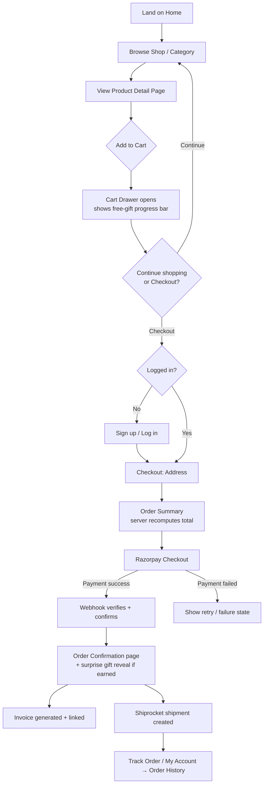
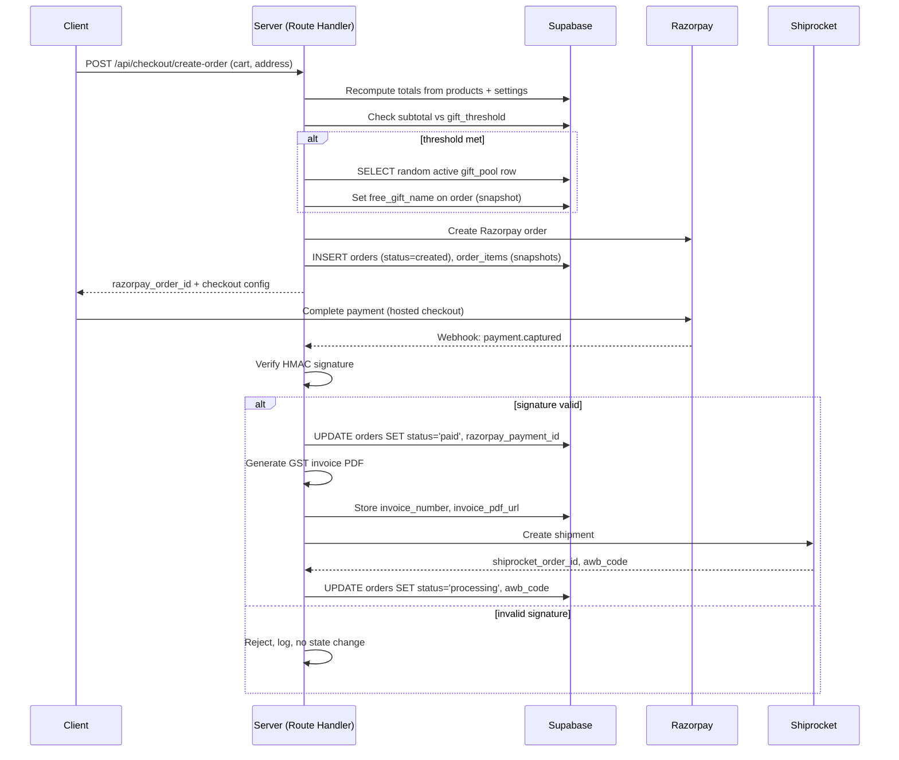
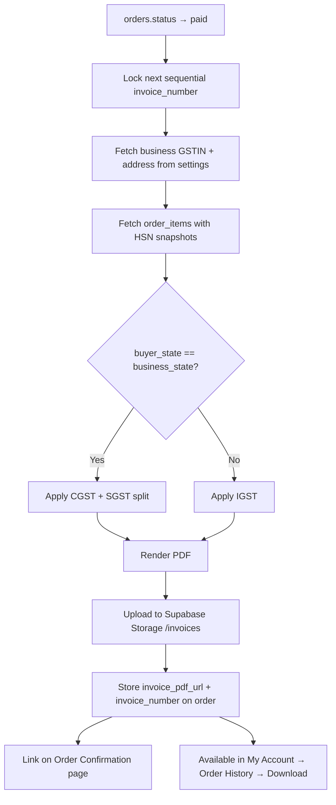
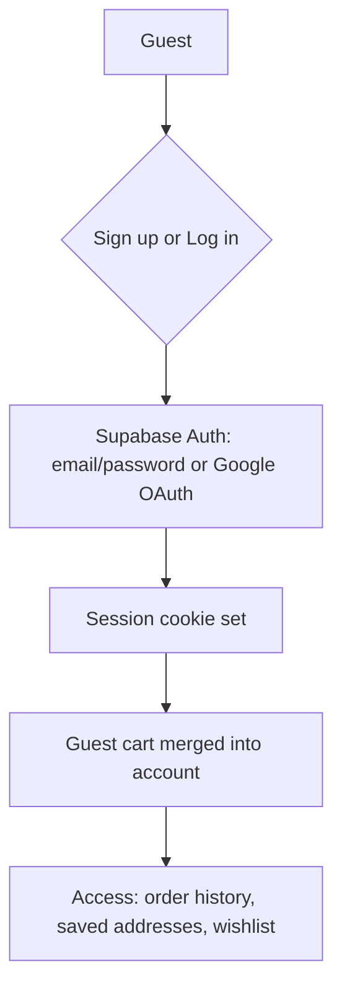

# Workflow Document
## AT Ornaments — E-Commerce Platform

Describes the key end-to-end workflows: customer purchase journey, payment/webhook flow, free-gift logic, invoice generation, shipping, and admin operations.

---

## 1. Customer Purchase Workflow



**Notes:**
- Guest browsing is allowed through the entire funnel until checkout; account is required only at the checkout gate (PRD §5).
- The free-gift progress bar is visible from the moment the cart drawer opens, updating live as items are added/removed.
- Order total is never trusted from the client — recomputed server-side at `POST /api/checkout/create-order`.

---

## 2. Payment & Fulfillment Workflow (server-side)



**Idempotency:** the webhook handler checks current `orders.status` before transitioning state, so a duplicate webhook delivery (Razorpay retries on non-2xx) does not double-generate invoices or double-create shipments.

---

## 3. Free Surprise Gift Workflow

```mermaid
flowchart LR
    A[Cart subtotal changes] --> B{subtotal >= threshold?}
    B -->|No| C[Show: "Add ₹X more for a free gift"]
    B -->|Yes| D[Show: "You've unlocked a free gift 🎁"]
    D --> E[At order creation:\nrandom pick from active gift_pool]
    E --> F[Snapshot name onto order.free_gift_name]
    F --> G[Shown in: Checkout summary]
    F --> H[Shown in: Order Confirmation reveal]
```

- No stock decrement or substitution logic in v1 — gift is applied purely on subtotal, regardless of the picked gift's real-world stock (PRD §7.3).
- Admin manages the pool and threshold independently (see Admin Workflow §5).

---

## 4. GST Invoice Generation Workflow



---

## 5. Admin Workflows

### 5.1 Daily silver rate update
```
Admin logs in → /admin → Silver Rate panel
  → enters today's rate per gram
  → POST /api/admin/silver-rate
  → settings.today_silver_rate_per_gram updated
  → all weight_based product prices recalculate on next read (no batch job needed —
    price is computed at read time, not stored)
```

### 5.2 Product management
```
Admin → /admin/products → Create/Edit
  → set name, category, pricing_type, weight/making_charge OR fixed_price,
    images (min. 2 for hover-swap), stock, hallmark/HUID if silver
  → POST/PATCH /api/admin/products
```

### 5.3 Gift pool & threshold management
```
Admin → /admin/gift-pool
  → add/remove gift names (is_active toggle) → POST /api/admin/gift-pool
  → update ₹ threshold → POST /api/admin/gift-threshold
```

### 5.4 Order management
```
Admin → /admin/orders
  → view list (status, customer, total)
  → view detail (items, gift, address, payment id, AWB)
  → re-download invoice
  → (manual) update status if a shipment issue requires override
```

### 5.5 GST / business settings
```
Admin → /admin/settings
  → enter/update GSTIN, registered address, invoice number prefix
  → POST /api/admin/gst-settings
  → used by every subsequent invoice generation
```

---

## 6. Account & Auth Workflow



---

## 7. Development / Build Workflow (Milestones)

Maps directly to PRD §14, sequenced so each milestone is independently demoable:

1. Foundation — Next.js + Supabase + Vercel skeleton, design tokens
2. Catalog & Motion Baseline — schema, admin CRUD, Home/Shop/PDP + hover-swap/reveal
3. Cart & Auth — drawer + animation, Supabase Auth, My Account
4. Free Gift Logic — `gift_pool` + threshold wired into drawer + checkout
5. Checkout & Payments — Razorpay end-to-end (test mode)
6. Shipping — Shiprocket integration + tracking
7. Admin polish — silver rate, gift pool manager, order dashboard
8. Motion polish — Shop by Look strip, stat counters, marquee, reduced-motion fallback
9. Content & Policies — About, Contact, static pages, real photography
10. Pre-launch QA — full test-mode purchase flow, mobile testing, KYC approvals
11. Go live — live mode payments/shipping, domain connected

### 7.1 Suggested CI/CD workflow (see `.github-workflows-ci.yml`)
```
On PR → lint + typecheck + build → Vercel preview deploy
On merge to main → build → Vercel production deploy (env vars from Vercel project settings)
```
